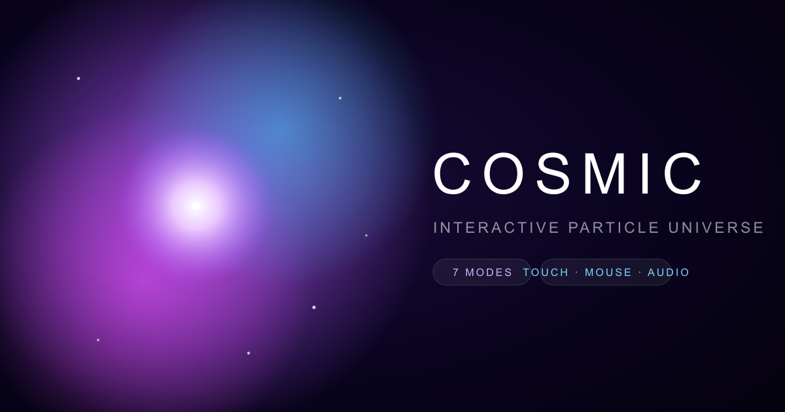

<div align="center">



# Cosmic Nebula

### An interactive particle universe that runs in your browser.

Seven living visual modes. Gravity that chases your finger. Supernovae you ignite with a tap.
Built to feel effortless on a phone *and* fill a 4K display.

<br/>


</div>

---

## ✦ What it is

Cosmic Nebula renders up to a few thousand particles on a single HTML5 canvas and runs a
tiny physics simulation over them every frame. You don't *watch* it — you *play* it. Your
pointer is a gravity well, every mode reshapes the whole field, and the engine quietly
re-tunes itself so it never drops frames, whether you're on a flagship desktop or a
mid-range phone.

No WebGL, no game engine, no 3 MB of dependencies for the visuals — just `requestAnimationFrame`,
2D canvas, and some careful engineering.

## ✦ Features

- **7 visual modes** — Nebula, Galaxy, Aurora, Fireflies, Black Hole, Web (constellation), and Vortex.
- **Unified input** — one Pointer Events pipeline drives **mouse, touch, pen and multi-touch**. Every finger is its own gravity well.
- **Tap to ignite** — a quick tap/click fires a **supernova**: a burst of sparks, an expanding shockwave, and an impulse that shoves nearby stars outward.
- **Attract / repel** — flip your pointer between pulling matter in and pushing it away.
- **7 colour palettes** — Cosmic Purple, Aurora Borealis, Solar Flare, Ice Crystal, Bioluminescent, Nebula Sunset, Stardust Gold.
- **Audio-reactive mode** — opt in to the mic and the universe pulses to sound (fully permission-gated, never auto-enabled).
- **Idle autopilot** — leave it alone and a roaming attractor keeps the scene alive. Great as an ambient display.
- **Capture & share** — save the current frame as a PNG, or copy a permalink that encodes your exact setup in the URL.
- **Installable PWA** — add it to your home screen and run it fullscreen, offline-friendly.

## ✦ Built for every screen

This is the part most "particle demos" skip.

| | Desktop | Tablet / Phone |
|---|---|---|
| **Input** | Hover to attract, click to ignite, full keyboard shortcuts | Drag to attract, tap to ignite, multi-touch wells |
| **Controls** | Floating glass panel, collapsible | Drag-to-dismiss bottom sheet with 44px+ touch targets |
| **Performance** | Particle budget up to ~3000, DPR up to 2 | Auto-tiered budget, DPR capped, governor scales live |
| **Layout** | — | Safe-area insets for notches, `dvh` units, scroll-bounce locked |

The headline trick is an **adaptive performance tier**: on mount the app reads
`hardwareConcurrency`, `deviceMemory`, pointer type, screen size and
`prefers-reduced-motion` to pick a starting particle budget — then an **FPS governor**
watches real frame time and raises or lowers the live particle count on the fly. A weak
device degrades *gracefully* instead of stuttering.

## ✦ Controls

**Keyboard (desktop)**

| Key | Action | | Key | Action |
|---|---|---|---|---|
| `1`–`7` | Switch visual mode | | `R` | Toggle attract / repel |
| `Space` | Pause / play | | `B` | Burst (random supernovae) |
| `G` | Toggle glow | | `F` | Fullscreen |
| `P` | Toggle autopilot | | `S` | Save PNG |
| `C` | Toggle controls panel | | | |

**Pointer**

- *Move / hover* (mouse) or *drag* (touch) → bend gravity toward the pointer.
- *Tap / click* → supernova.
- *Multi-touch* → multiple simultaneous gravity wells.

## ✦ Tech stack

- **Next.js 16** (App Router) · **React 19** · **TypeScript**
- **HTML5 Canvas 2D** for the simulation (sprite-batched additive glow)
- **Tailwind CSS v4** · **Framer Motion** for UI · **lucide-react** icons · **sonner** toasts

## ✦ Getting started

```bash
# install (npm, pnpm, or bun all work)
npm install

# run the dev server
npm run dev
# → http://localhost:3000
```

Build for production:

```bash
npm run build && npm run start
```

## ✦ How it's built

A few deliberate engineering decisions keep it smooth:

- **The animation loop mounts once.** Live settings are mirrored into refs and read by the
  `requestAnimationFrame` loop, so dragging a slider never tears down or reseeds the
  simulation. React owns the UI; the loop owns the pixels.
- **Glow is sprite-batched.** Instead of building a radial gradient per particle per frame,
  the engine pre-renders one glow sprite per palette colour and `drawImage`s them. This is
  the single biggest reason it stays fast on phones.
- **Trails are a global canvas fade**, not per-particle history — O(1) memory no matter how
  many particles are alive.
- **One source of truth.** Modes, palettes, presets, device tiers and the settings schema
  all live in [`src/lib/cosmic.ts`](./src/lib/cosmic.ts), imported by both the engine and
  the UI so they can never disagree.

```
src/
├─ app/
│  ├─ layout.tsx        # metadata, PWA manifest, viewport, fonts
│  ├─ page.tsx          # orchestration: state, persistence, responsive layout
│  └─ globals.css       # app chrome (glass, sliders, mobile lock)
├─ components/
│  ├─ CosmicCanvas.tsx  # the imperative particle engine
│  └─ CosmicControls.tsx# presentational control surface
└─ lib/
   └─ cosmic.ts         # modes · palettes · presets · device tiers · settings
```

## ✦ License

[MIT](./LICENSE) — do anything you like. A link back is appreciated, never required.

<div align="center"><br/><sub>Made with curiosity. Point, drag, and ignite. 🌌</sub></div>
